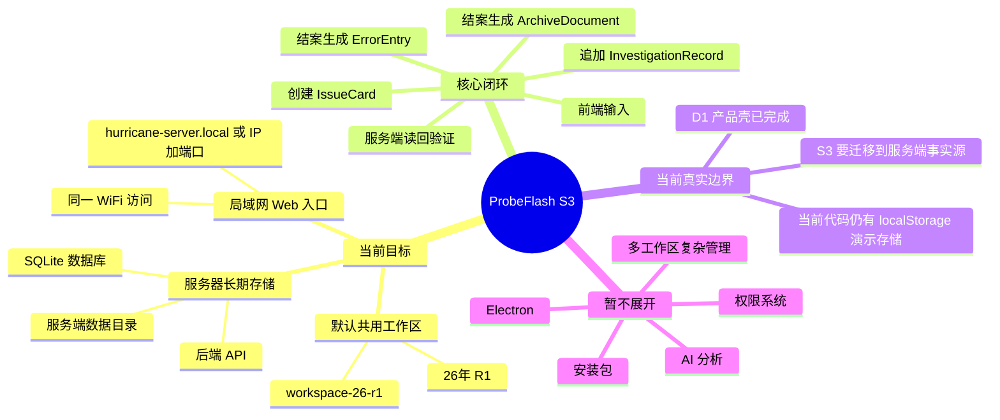

# 01-项目目标与边界图

## 这张图回答什么问题

这张图回答：ProbeFlash 在当前 S3 阶段到底要交付什么，以及哪些方向明确暂不展开。它用于统一边界，避免把局域网共享与服务器长期存储之外的内容混入当前主线。

```mermaid
mindmap
  root((ProbeFlash S3))
    当前目标
      局域网 Web 入口
        同一 WiFi 访问
        hurricane-server.local 或 IP 加端口
      服务器长期存储
        后端 API
        SQLite 数据库
        服务端数据目录
      默认共用工作区
        workspace-26-r1
        26年 R1
    核心闭环
      前端输入
      创建 IssueCard
      追加 InvestigationRecord
      结案生成 ArchiveDocument
      结案生成 ErrorEntry
      服务端读回验证
    当前真实边界
      D1 产品壳已完成
      当前代码仍有 localStorage 演示存储
      S3 要迁移到服务端事实源
    暂不展开
      AI 分析
      权限系统
      Electron
      安装包
      多工作区复杂管理
```

## 补充说明

S3 的验收重点是“同一 WiFi 下访问同一服务器，并读写同一份长期数据”，不是扩展高级功能。
