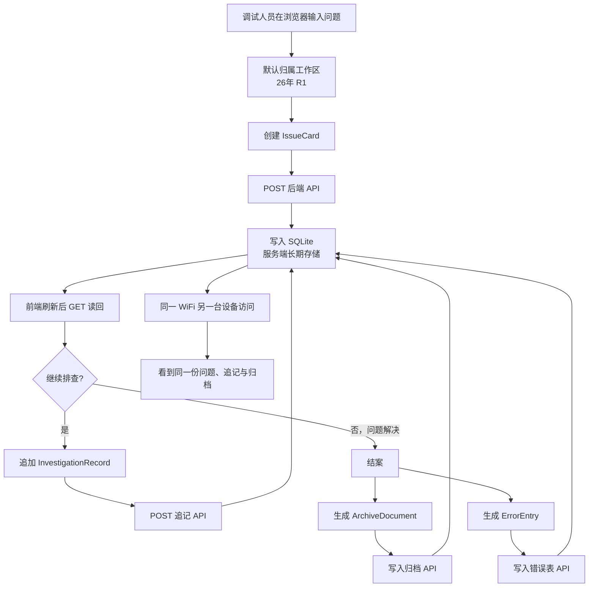

# 02-S3最小需求闭环图

## 这张图回答什么问题

这张图回答：S3 阶段最小可用闭环是什么。它把前端输入、后端 API、SQLite 持久化、跨设备读回和结案归档串成一条可验收路径。

```mermaid
flowchart TD
    A[调试人员在浏览器输入问题] --> B[默认归属工作区<br/>26年 R1]
    B --> C[创建 IssueCard]
    C --> D[POST 后端 API]
    D --> E[写入 SQLite<br/>服务端长期存储]
    E --> F[前端刷新后 GET 读回]
    F --> G{继续排查?}
    G -->|是| H[追加 InvestigationRecord]
    H --> I[POST 追记 API]
    I --> E
    G -->|否，问题解决| J[结案]
    J --> K[生成 ArchiveDocument]
    J --> L[生成 ErrorEntry]
    K --> M[写入归档 API]
    L --> N[写入错误表 API]
    M --> E
    N --> E
    E --> O[同一 WiFi 另一台设备访问]
    O --> P[看到同一份问题、追记与归档]
```

## 补充说明

这条闭环只要求单个默认共用工作区先跑通；不把多工作区复杂管理作为当前验收条件。
