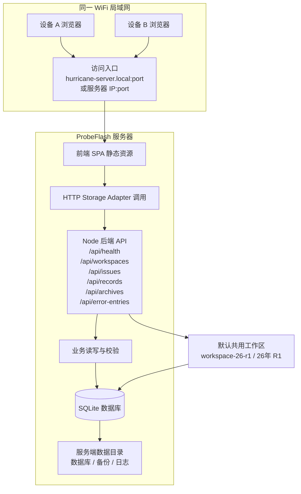

# 03-S3目标系统架构图

## 这张图回答什么问题

这张图回答：S3 目标形态下，浏览器前端、局域网入口、后端 API 与 SQLite 如何协作。它是后续后端脚手架、HTTP storage adapter 和部署说明的架构基准。

```mermaid
flowchart TB
    subgraph LAN[同一 WiFi 局域网]
        U1[设备 A 浏览器]
        U2[设备 B 浏览器]
        Entry[访问入口<br/>hurricane-server.local:port<br/>或服务器 IP:port]
    end

    subgraph Server[ProbeFlash 服务器]
        Static[前端 SPA 静态资源]
        Adapter[HTTP Storage Adapter 调用]
        API[Node 后端 API<br/>/api/health<br/>/api/workspaces<br/>/api/issues<br/>/api/records<br/>/api/archives<br/>/api/error-entries]
        Service[业务读写与校验]
        DB[(SQLite 数据库)]
        DataDir[服务端数据目录<br/>数据库 / 备份 / 日志]
    end

    U1 --> Entry
    U2 --> Entry
    Entry --> Static
    Static --> Adapter
    Adapter --> API
    API --> Service
    Service --> DB
    DB --> DataDir

    API --> W[默认共用工作区<br/>workspace-26-r1 / 26年 R1]
    W --> DB
```

## 补充说明

当前还没有后端和数据库实现；本图描述 S3 目标架构，不把 localStorage 作为最终事实源。
