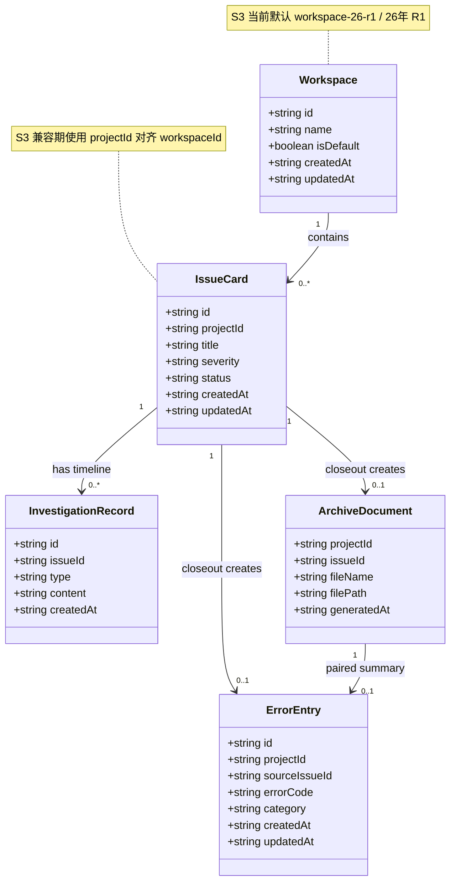

# 04-核心领域模型图

## 这张图回答什么问题

这张图回答：ProbeFlash S3 最小闭环里有哪些核心领域对象，以及它们之间如何关联。它用于让前端表单、后端 API 和 SQLite schema 使用同一套对象语言。

```mermaid
classDiagram
    class Workspace {
      +string id
      +string name
      +boolean isDefault
      +string createdAt
      +string updatedAt
    }

    class IssueCard {
      +string id
      +string projectId
      +string title
      +string severity
      +string status
      +string createdAt
      +string updatedAt
    }

    class InvestigationRecord {
      +string id
      +string issueId
      +string type
      +string content
      +string createdAt
    }

    class ArchiveDocument {
      +string projectId
      +string issueId
      +string fileName
      +string filePath
      +string generatedAt
    }

    class ErrorEntry {
      +string id
      +string projectId
      +string sourceIssueId
      +string errorCode
      +string category
      +string createdAt
      +string updatedAt
    }

    Workspace "1" --> "0..*" IssueCard : contains
    IssueCard "1" --> "0..*" InvestigationRecord : has timeline
    IssueCard "1" --> "0..1" ArchiveDocument : closeout creates
    IssueCard "1" --> "0..1" ErrorEntry : closeout creates
    ArchiveDocument "1" --> "0..1" ErrorEntry : paired summary

    note for Workspace "S3 当前默认 workspace-26-r1 / 26年 R1"
    note for IssueCard "S3 兼容期使用 projectId 对齐 workspaceId"
```

## 补充说明

S3 初期只固定默认共用工作区；未来如需增加工作区管理，应在这个模型上扩展，而不是改写当前闭环。
