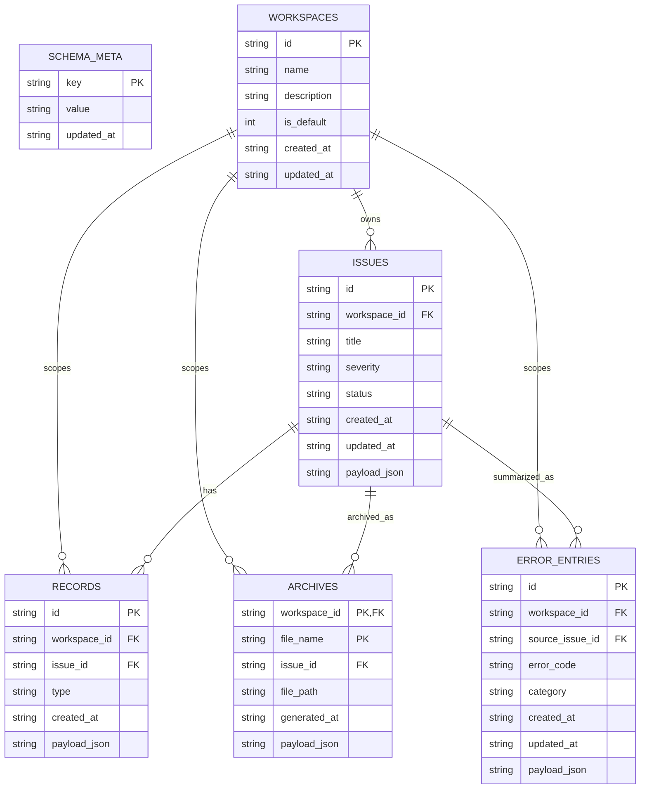

# 05-SQLiteER图

## 这张图回答什么问题

这张图回答：S3 服务器长期存储最小需要哪些 SQLite 表，以及这些表如何通过 workspace 和 issue 关联。它对应当前 schema 草案，用于后续实现初始化、CRUD 和读回验证。

## 补充说明

业务实体保留完整 `payload_json`，投影列只服务列表、排序、约束和调试读回；默认 workspace 初始值为 `workspace-26-r1 / 26年 R1`。
