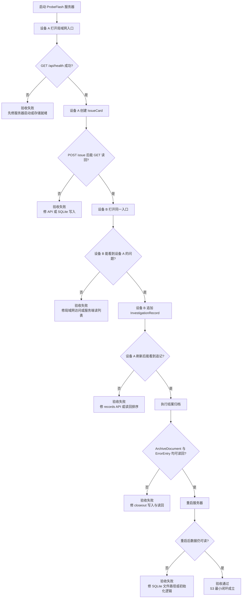

# 06-S3验收流程图

## 这张图回答什么问题

这张图回答：什么情况下可以认为 S3 的“局域网共享 + 服务器长期存储”闭环真的完成。它把健康检查、写入读回、跨设备可见和重启后持久化放进同一条验收流程。

```mermaid
flowchart TD
    A[启动 ProbeFlash 服务器] --> B[设备 A 打开局域网入口]
    B --> C{GET /api/health 成功?}
    C -->|否| C1[验收失败<br/>先修服务器启动或存储就绪]
    C -->|是| D[设备 A 创建 IssueCard]
    D --> E{POST issue 后能 GET 读回?}
    E -->|否| E1[验收失败<br/>修 API 或 SQLite 写入]
    E -->|是| F[设备 B 打开同一入口]
    F --> G{设备 B 能看到设备 A 的问题?}
    G -->|否| G1[验收失败<br/>修局域网访问或服务端读列表]
    G -->|是| H[设备 B 追加 InvestigationRecord]
    H --> I{设备 A 刷新后能看到追记?}
    I -->|否| I1[验收失败<br/>修 records API 或读回排序]
    I -->|是| J[执行结案归档]
    J --> K{ArchiveDocument 与 ErrorEntry 均可读回?}
    K -->|否| K1[验收失败<br/>修 closeout 写入与读回]
    K -->|是| L[重启服务器]
    L --> M{重启后数据仍可读?}
    M -->|否| M1[验收失败<br/>修 SQLite 文件路径或初始化逻辑]
    M -->|是| N[验收通过<br/>S3 最小闭环成立]
```

## 补充说明

验收不能用 localStorage 结果代替；必须通过同一服务器和 SQLite 数据完成跨设备与重启读回。
